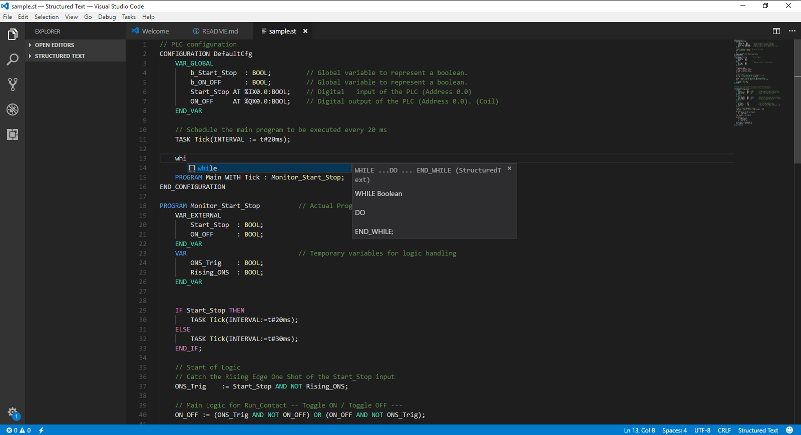

# Structured_Text_PLCs
# Structured Text PCLs

Structured Text PCLs is a language support for Structured Text.
Autocomplete and syntax colorization

## Getting Started

```
Just download the extension and enjoy how easys it will be for you to
write your code and see how beautiful it will look like.
```




<div style='float: center'>
  </img>
</div>


## How to install

* Install [Visual Studio Code](https://code.visualstudio.com/)
* Open View -> Command Palette... and type install extensions
* Type Structured Text PLCs
* Click install
* Restart Visual Studio Code


## Authors

* **[Smook Creative](https://smookcreative.com)**


## License

Copyright (c) 2017 Smook Creative


